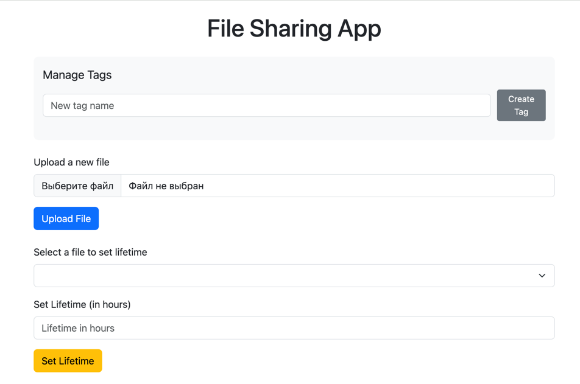
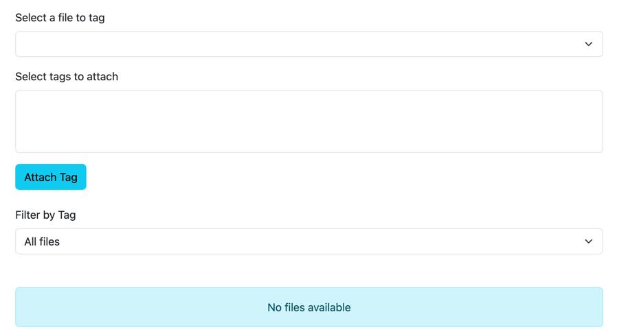
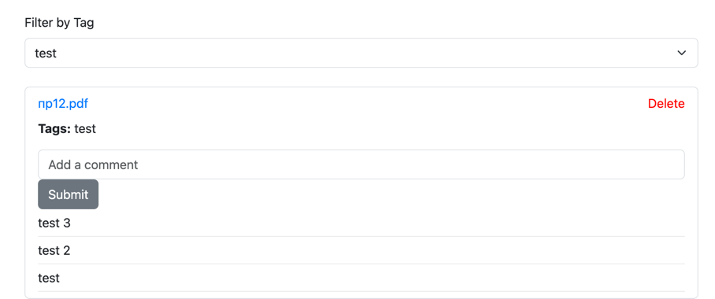

## Облачное хранилище для файлов на Spring Boot

### Инструкция по запуску

1. Соберите приложение с помощью mvn clean install -DskipTests=true
2. Запустите приложение с помощью docker-compose up --build
3. Приложение доступно по адресу
   http://localhost:8080/index.html

### Использованные технологии
- Spring Boot
- Postgresql
- Spring Data Jpa
- Maven
- Docker
- Liquibase

### Функционал приложения

- Добавление/удаления файла в хранилище
- Добавление комметариев к файлу
- Добавление/удаление тега
- Добавление/удаление тега к файлу
- Поиск среди файлов по тегу
- Запланированное удаление файла

### Демонстрация работы приложения

**Пример работы с файлом**

