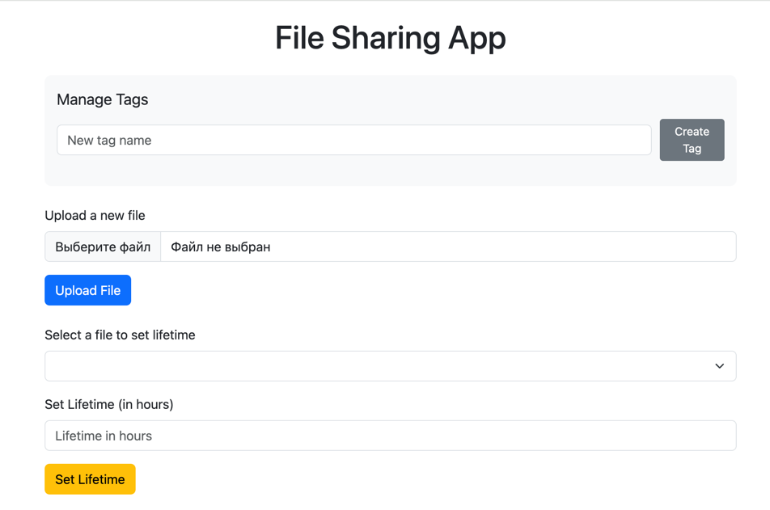
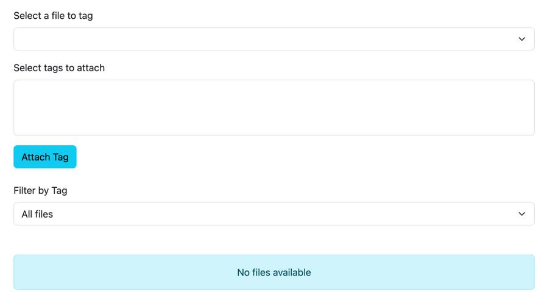
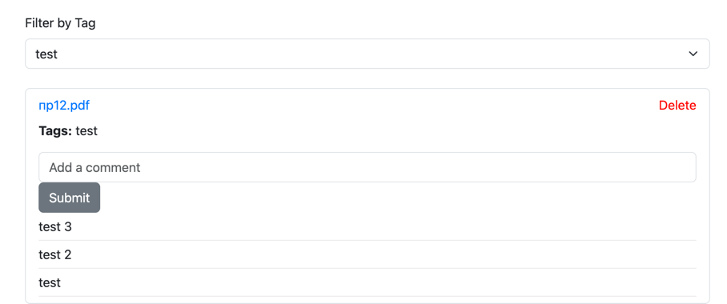

## Облачное хранилище для файлов на Spring Boot

### Инструкция по запуску

1. Скопируйте репозиторий командой.
```angular2html
git clone https://github.com/DmitriiLarin/file-sharing
```
2. Создайте файл ```.env``` в корне репозитория и заполните его.
```angular2html
ACCESS_KEY = #YOUR_ACCESS_KEY
SECRET_KEY = #YOUR_SECREY_KEY
ENDPOINT = #YOUR_ENDPOINT
BUCKET = #YOUR_BUCKET_NAME
```
3. Соберите приложение.
```angular2html
mvn clean install -DskipTests=true
```
4. Запустите приложение с помощью Docker.
```angular2html
docker-compose up --build
```
5. Приложение доступно по адресу.
```angular2html
http://localhost:8080/index.html
```

### Использованные технологии
- Spring Boot
- Postgresql
- Spring Data Jpa
- Maven
- Docker
- Liquibase


### Функционал приложения

- Добавление/удаления файла в хранилище
- Добавление комметариев к файлу
- Добавление/удаление тега
- Добавление/удаление тега к файлу
- Поиск среди файлов по тегу
- Запланированное удаление файла

### Демонстрация работы приложения




**Пример работы с файлом**

